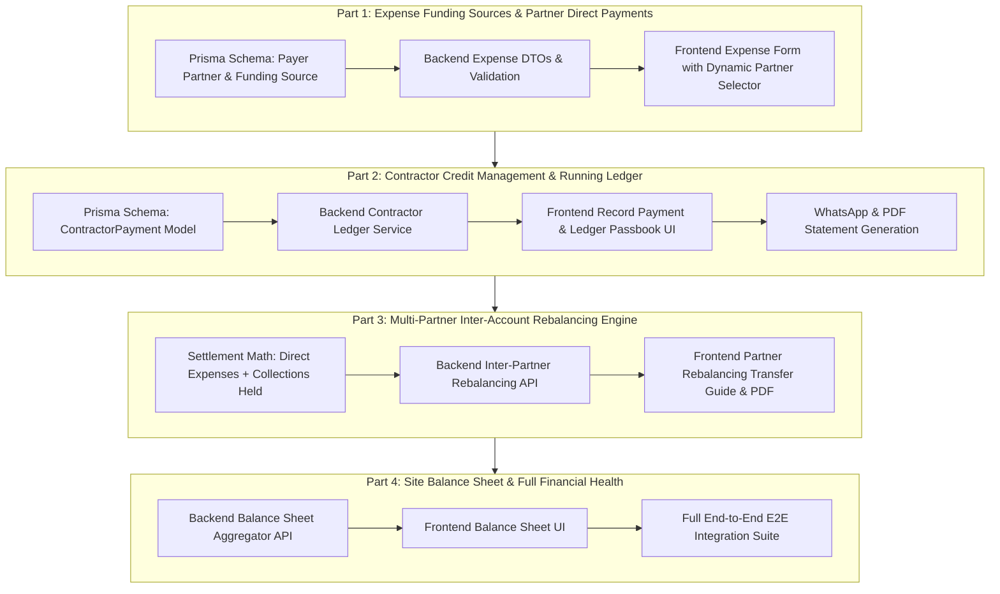

# 🗺️ Hurdle 15: Master Financial & Operational Expansion Plan

## 📌 Overview
This document outlines the complete architectural roadmap for **Hurdle 15: Financial Governance, Multi-Partner Rebalancing & Contractor Party Ledger** in VLMS.

---

## 🏗️ The 4 Phases of Hurdle 15

---

## 📋 Phase Breakdown

### [Part 1: Expense Funding Sources & Multi-Partner Direct Payment Engine](./part-1/implementation_plan.md)
* **Goal**: Support `Site Drawer`, `Owner Direct`, `Co-Partner Direct` (with specific partner selector), `Vendor Credit`, and `Company Bank`.
* **Database**: Update `PaymentMode` enum to include `CO_PARTNER_DIRECT`, add `payerPartnerUserId`, `transferMethod`, and `referenceNumber` to `Expense`.
* **Backend**: Validate `payerPartnerUserId` when mode is `CO_PARTNER_DIRECT`, enforce site tenancy and partner role.
* **Frontend**: Dynamic UI modal with partner dropdown, payer badges in tables, and filtering.

### [Part 2: Contractor Credit Management, Collections & Running Party Ledger](./part-2/implementation_plan.md)
* **Goal**: Full party ledger for credit customers with partial collections and "Who Collected the Cash?" tracking.
* **Database**: Create `ContractorPayment` model linking site, contractor, and collector (`collectedByUserId`).
* **Backend**: `POST/GET /api/v1/contractor-payments`, `GET /api/v1/contractors/:id/ledger` computing running balances.
* **Frontend**: "Record Payment" modal, Live Passbook view, PDF statement export, and WhatsApp sharing.

### [Part 3: Multi-Partner Inter-Account Rebalancing & Settlement Engine](./part-3/implementation_plan.md)
* **Goal**: Reconcile 4 personal bank/GPay accounts without a company account.
* **Backend**: Compute Net Position: $\text{Profit Share} + \text{Expenses Borne} - \text{Collections Held} - \text{Drawings Taken}$.
* **Algorithm**: Debt Rebalancing algorithm producing minimal transfer instructions (*"Partner A transfers ₹40k to Partner C"*).
* **Frontend**: Interactive partner cashflow cards, visual transfer guide, and downloadable settlement PDF.

### [Part 4: Site Balance Sheet & Comprehensive Financial Health Statement](./part-4/implementation_plan.md)
* **Goal**: Complete Financial Health view adhering to $\text{Assets} = \text{Liabilities} + \text{Partner Equity}$.
* **Backend**: `GET /api/v1/reports/balance-sheet` aggregating Debtors, Drawers, Partner Cash, Creditors, and Equity.
* **Frontend**: Tabbed financial reports (P&L + Balance Sheet + Partner Settlement), balance verification indicator, and full E2E suite.
